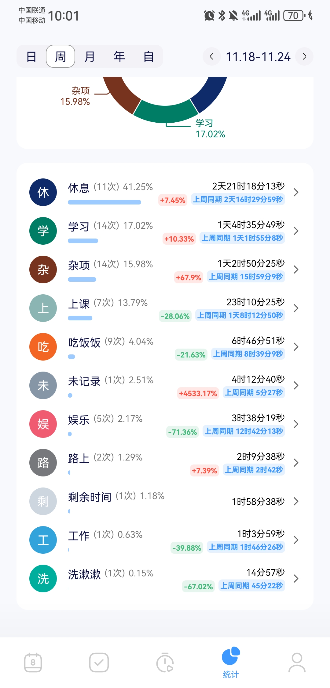

# Week02(2024/11/18 - 2024/11/24)

## 总结

---

- 课多+疯狂点名+不准使用电子产品，理解不了有什么意义。感觉学了计算机就无法理解其他专业了，因为上课真的会耽误学习，难道其他专业都是好好去上课的吗，理解不能了。
- 这周很忙但又不知道在忙什么，很累但又不知道因为什么很累，好几天都是9、10点钟上床直接倒头就睡(
- 周末花了大约一下午的时间捣鼓 cursor + sealos cloud，只能说 AI 编程似乎没有传说中的那么玄乎，不过好用还是好用的，就是我的运维水平有点菜，搞不懂怎么用 sealos cloud，有空学一学 k8s 吧
- 同上周，正在推 spring

## Deadline

- [x] 英语Assess2(做了一半) **( Due: 2024-11-29 )**
- [ ] 毛概考试 **( Due: 十六周 )**
- [ ] 马原考试 **( Due: 十六周 )**

## 短期计划

- [ ] 背
- [ ] 背
- [ ] 背

## 长期计划

- [ ] 写完UCB CS61B的gitlet
- [ ] UCB CS61C
- [ ] USTC计算机网络
