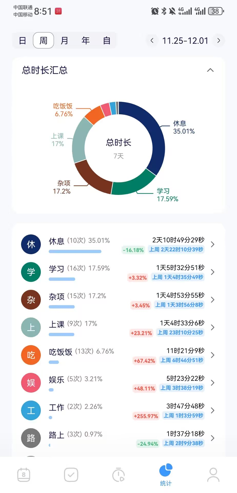

# Week03(2024/11/25 - 2024/12/01)

## 总结

----

* 这周赚到了大学的第一桶金, 虽然就一点点零花钱，但我似乎窥探到了一点大学内部商业的门径(? 。其实比起那一点零花钱更重要的是让我对人心有了更深的了解吧
* 周末过了答辩(喜
* 学习方面并没有什么推进，主要是还是一些课业压力导致的，很烦...
* 我发现我似乎很喜欢开新坑，最近又开了一门 Missing Semester 感觉还挺有意思的，希望能坚持看下去

## Deadline

- [ ] 毛概考试 **( Due: 十六周 )**
- [ ] 马原考试 **( Due: 十六周 )**

## 短期计划

- [ ] 背
- [ ] 背
- [ ] 背

## 长期计划

- [ ] 写完CS61B的gitlet
- [ ] CS61C
- [ ] 计算机网络
- [ ] Missing Semester

