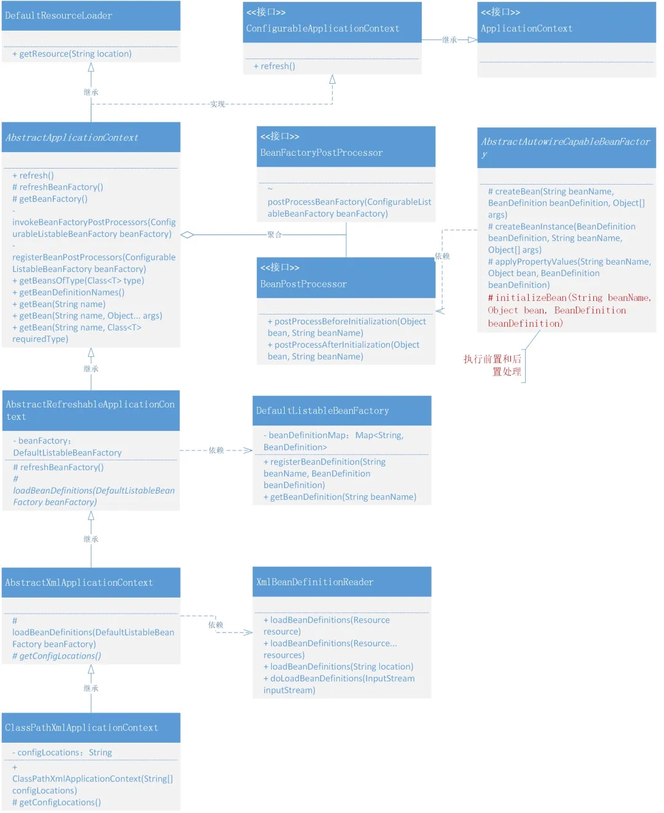

# 实现应用上下文，自动识别、资源加载、扩展机制

## 1. 目标

如果你在自己的实际工作中开发过基于 `Spring` 的技术组件，或者学习过关于 `SpringBoot` 中间件设计和开发 等内容。那么你一定会**继承或者实现**了 `Spring` 对外**暴露的类或接口**，在接口的实现中获取了 `BeanFactory` 以及 `Bean` 对象的获取等内容，并对这些内容做一些操作，例如：修改 Bean 的信息，添加日志打印、处理数据库路由对数据源的切换、给 RPC 服务连接注册中心等。

在对容器中 `Bean` 的**实例化**过程添加扩展机制的同时，还需要把目前关于 **Spring.xml 初始化和加载策略**进行优化，因为我们不太可能让面向 `Spring` 本身开发的 `DefaultListableBeanFactory` 服务，直接给予用户使用。修改点如下：


----

* `DefaultListableBeanFactory`、`XmlBeanDefinitionReader`，是我们在目前 `Spring` 框架中对于服务功能测试的使用方式，它能很好的体现出 `Spring` 是**如何对 xml 加载以及注册Bean对象**的操作过程，但这种方式是面向 `Spring` 本身的，还不具备一定的扩展性。
* 就像我们现在需要提供出一个可以在 `Bean` 初始化过程中，完成对 `Bean` 对象的扩展时，就很难做到自动化处理。所以我们要把 `Bean` 对象扩展机制功能和对 `Spring` 框架上下文的包装融合起来，对外提供完整的服务。


## 2. 设计

为了能满足于在 `Bean` 对象从注册到实例化的过程中执行用户的**自定义**操作，就需要在 `Bean` 的定义和初始化过程中
插入接口类，这个接口再有外部去实现自己需要的服务。那么在结合对 `Spring` 框架上下文的处理能力，就可以满足我们的目标需求了。整体设计结构如下图：


---

* 满足于对 **Bean 对象扩展**的两个接口，其实也是 Spring 框架中非常具有重量级的两个接口：`BeanFactoryPostProcess` 和 `BeanPostProcessor`，也几乎是大家在使用 Spring 框架额外**新增开发自己组建需求的两个必备接口**。
* `BeanFactoryPostProcessor`，是由 Spring 框架组建提供的**容器扩展机制**，允许**在 Bean 对象注册后但未实例化之前**，对 Bean 的定义信息 `BeanDefinition` 执行**修改**操作。
* `BeanPostProcessor`，也是 Spring 提供的**扩展机制**，不过 `BeanPostProcessor` 是**在 Bean 对象实例化之后修改 Bean 对象**，也可以**替换** Bean 对象。这部分与后面要实现的 **AOP** 有着密切的关系。
* 同时如果只是添加这两个接口，不做任何包装，那么对于使用者来说还是非常麻烦的。我们希望于**开发** `Spring` 的**上下文操作类**，**把相应的 XML 加载 、注册、实例化以及新增的修改和扩展都融合进去**，让 Spring 可以自动扫描到我们的新增服务，便于用户使用。

---
关于 `BeanPostProcessor` 和 `BeanFactoryPostProcess` 的对比总结：


| 特性       | BeanFactoryPostProcess                              | BeanPostProcessor                              |
|------------|-----------------------------------------------------|------------------------------------------------|
| 作用对象   | Bean定义 （BeanDefinition）                           | Bean 初始化前后                                |
| 执行时机   | Bean 实例化之前，配置加载后                          | Bean 初始化前后                                |
| 主要功能   | 修改 Bean 的元数据，动态调整配置                     | 增强或代理 Bean，添加功能                       |
| 典型场景   | - 动态修改属性值 - 占位符解析 - 添加/删除 Bean 定义 | - AOP 代理 - 注解处理 - 动态增强               |
| 常见实现类 | PropertySourcesPlaceholderConfigurer                | AutowiredAnnotationBeanPostProcessor- AOP 相关 |

---

**关键点：**

* `BeanFactoryPostProcessor` 操作的是**容器中的 Bean 定义，改变的是 Bean 的配置。**
* `BeanPostProcessor` 操作的是**容器中的 Bean 实例，改变的是运行时的行为。**


## 3. 实现

### **1. 工程结构**

```
simple-spring-06
└── src
    ├── main
    │   ├── java
    │   │   └── com
    │   │       └── iflove
    │   │           └── simplespring
    │   │               ├── beans
    │   │               │   ├── BeansException.java
    │   │               │   ├── PropertyValue.java
    │   │               │   ├── PropertyValues.java
    │   │               │   └── factory
    │   │               │       ├── BeanFactory.java
    │   │               │       ├── ConfigurableListableBeanFactory.java
    │   │               │       ├── HierarchicalBeanFactory.java
    │   │               │       ├── ListableBeanFactory.java
    │   │               │       ├── config
    │   │               │       │   ├── AutowireCapableBeanFactory.java
    │   │               │       │   ├── BeanDefinition.java
    │   │               │       │   ├── BeanFactoryPostProcessor.java
    │   │               │       │   ├── BeanPostProcessor.java
    │   │               │       │   ├── BeanReference.java
    │   │               │       │   ├── ConfigurableBeanFactory.java
    │   │               │       │   └── SingletonBeanRegistry.java
    │   │               │       ├── support
    │   │               │       │   ├── AbstractAutowireCapableBeanFactory.java
    │   │               │       │   ├── AbstractBeanDefinitionReader.java
    │   │               │       │   ├── AbstractBeanFactory.java
    │   │               │       │   ├── BeanDefinitionReader.java
    │   │               │       │   ├── BeanDefinitionRegistry.java
    │   │               │       │   ├── CglibSubclassingInstantiationStrategy.java
    │   │               │       │   ├── DefaultListableBeanFactory.java
    │   │               │       │   ├── DefaultSingletonBeanRegistry.java
    │   │               │       │   ├── InstantiationStrategy.java
    │   │               │       │   └── SimpleInstantiationStrategy.java
    │   │               │       └── xml
    │   │               │           └── XmlBeanDefinitionReader.java
    │   │               ├── context
    │   │               │   ├── ApplicationContext.java
    │   │               │   ├── ConfigurableApplicationContext.java
    │   │               │   └── support
    │   │               │       ├── AbstractApplicationContext.java
    │   │               │       ├── AbstractRefreshableApplicationContext.java
    │   │               │       ├── AbstractXmlApplicationContext.java
    │   │               │       └── ClassPathXmlApplicationContext.java
    │   │               ├── core
    │   │               │   └── io
    │   │               │       ├── ClassPathResource.java
    │   │               │       ├── DefaultResourceLoader.java
    │   │               │       ├── FileSystemResource.java
    │   │               │       ├── Resource.java
    │   │               │       ├── ResourceLoader.java
    │   │               │       └── UrlResource.java
    │   │               └── utils
    │   │                   └── ClassUtils.java
    │   └── resources
    └── test
        ├── java
        │   └── test
        │       ├── ApiTest.java
        │       ├── bean
        │       │   ├── UserDao.java
        │       │   └── UserService.java
        │       └── common
        │           ├── MyBeanFactoryPostProcessor.java
        │           └── MyBeanPostProcessor.java
        └── resources
            ├── important.properties
            ├── spring.xml
            └── springPostProcessor.xml
```

---

**Spring 应用上下文和对Bean对象扩展机制的类关系:**




* 在整个类图中主要体现出来的是关于 **Spring 应用上下文**以及**对 Bean 对象扩展机制**的实现。
* 以继承了 `ListableBeanFactory` 接口的 `ApplicationContext` 接口开始，扩展出一系列应用上下文的抽象实现类，并最终完成 `ClassPathXmlApplicationContext` 类的实现。而这个类就是最后交给用户使用的类。
* 同时在实现应用上下文的过程中，通过定义接口：`BeanFactoryPostProcessor`、`BeanPostProcessor` 两个接口，把关于对 Bean 的扩展机制串联进去了。


---

### **2. 定义 BeanFactoryPostProcessor**

```java
public interface BeanFactoryPostProcessor {

    /**
     * 在所有的 BeanDefinition 加载完成后，实例化 Bean 对象之前，提供修改 BeanDefinition 属性的机制
     *
     * @param beanFactory   bean工厂
     */
    void postProcessBeanFactory(ConfigurableListableBeanFactory beanFactory) throws BeansException;

}
```

- 在 Spring 源码中有这样一段描述 **Allows for custom modification of an application context's bean definitions,adapting the bean property values of the context's underlying bean factory. 其实也就是说这个接口是满足于在所有的 BeanDefinition** 加载完成后，实例化 Bean 对象之前，提供修改 BeanDefinition 属性的机制。


---

### **3. 定义 BeanPostProcessor**

```java
public interface BeanPostProcessor {

    /**
     * 在 Bean 对象执行初始化方法之前，执行此方法
     *
     * @param bean bean对象
     * @param beanName bean名称
     * @return 修改后的 Bean 实例
     * @throws BeansException
     */
    Object postProcessBeforeInitialization(Object bean, String beanName) throws BeansException;

    /**
     * 在 Bean 对象执行初始化方法之后，执行此方法
     *
     * @param bean bean对象
     * @param beanName bean名称
     * @return 修改后的 Bean 实例
     * @throws BeansException
     */
    Object postProcessAfterInitialization(Object bean, String beanName) throws BeansException;
}
```

* 在 Spring 源码中有这样一段描述 **Factory hook that allows for custom modification of new bean instances,e.g. checking for marker interfaces or wrapping them with proxies.** 也就是提供了修改新实例化 Bean 对象的扩展点。
* 另外此接口提供了两个方法：`postProcessBeforeInitialization` 用于在 **Bean 对象执行初始化方法之前**，执行此方法、`postProcessAfterInitialization`用于**在 Bean 对象执行初始化方法之后**，执行此方法。

---

### **4. 定义上下文接口**

```java
public interface ApplicationContext extends ListableBeanFactory {
}
```

* `context` 是本次实现应用上下文功能新增的服务包
* `ApplicationContext`，继承于 `ListableBeanFactory`，也就继承了关于 `BeanFactory` 方法，比如一些 `getBean` 的方法。另外 `ApplicationContext` 本身是 **Central** 接口，但目前还不需要添加一些获取ID和父类上下文，所以暂时没有接口方法的定义。

---

```java
public interface ConfigurableApplicationContext extends ApplicationContext {

    /**
     * 刷新容器
     *
     * @throws BeansException
     */
    void refresh() throws BeansException;
}
```

- `ConfigurableApplicationContext` 继承自 `ApplicationContext`，并提供了 `refresh` 这个核心方法。**如果你有看过一些 Spring 源码，那么一定会看到这个方法**。 接下来也是需要在上下文的实现中完成刷新容器的操作过程。

---


### **5. 应用上下文抽象类实现**

```java
public abstract class AbstractApplicationContext extends DefaultResourceLoader implements ConfigurableApplicationContext {

    @Override
    public void refresh() throws BeansException {
        // 1. 创建 BeanFactory，并加载 BeanDefinition
        refreshBeanFactory();

        // 2. 获取 beanFactory
        ConfigurableListableBeanFactory beanFactory = getBeanFactory();

        // 3.  在 Bean 实例化之前，执行 BeanFactoryPostProcessor (Invoke factory processors registered as beans in the context.)
        invokeBeanFactoryPostProcessors(beanFactory);

        // 4. BeanPostProcessor 需要提前于其他 Bean 对象实例化之前执行注册操作
        registerBeanPostProcessors(beanFactory);

        // 5. 提前实例化单例Bean对象
        beanFactory.preInstantiateSingletons();
    }


    protected abstract void refreshBeanFactory() throws BeansException;

    protected abstract ConfigurableListableBeanFactory getBeanFactory();

    private void invokeBeanFactoryPostProcessors(ConfigurableListableBeanFactory beanFactory) {
        Map<String, BeanFactoryPostProcessor> beanFactoryPostProcessorMap = beanFactory.getBeansOfType(BeanFactoryPostProcessor.class);
        for (BeanFactoryPostProcessor processor : beanFactoryPostProcessorMap.values()) {
            processor.postProcessBeanFactory(beanFactory);
        }
    }

    private void registerBeanPostProcessors(ConfigurableListableBeanFactory beanFactory) {
        Map<String, BeanPostProcessor> beanPostProcessorMap = beanFactory.getBeansOfType(BeanPostProcessor.class);
        for (BeanPostProcessor processor : beanPostProcessorMap.values()) {
            beanFactory.addBeanPostProcessor(processor);
        }
    }

    @Override
    public <T> Map<String, T> getBeansOfType(Class<T> type) throws BeansException {
        return getBeanFactory().getBeansOfType(type);
    }

    @Override
    public String[] getBeanDefinitionNames() {
        return getBeanFactory().getBeanDefinitionNames();
    }

    @Override
    public <T> T getBean(String beanName, Class<T> requiredType) throws BeansException {
        return getBeanFactory().getBean(beanName, requiredType);
    }

    @Override
    public Object getBean(String beanName, Object... args) throws BeansException {
        return getBeanFactory().getBean(beanName, args);
    }

    @Override
    public Object getBean(String beanName) throws BeansException {
        return getBeanFactory().getBean(beanName);
    }
}
```

* `AbstractApplicationContext` 继承 `DefaultResourceLoader` 是为了处理 `spring.xml` 配置资源的加载。
* 之后是在 `refresh()` 定义实现过程，包括：

    1. 创建 `BeanFactory`，并加载 `BeanDefinition`
    2. 获取 `BeanFactory`
    3. 在 Bean 实例化之前，执行 `BeanFactoryPostProcessor` (**Invoke factory processors registered as beans in the context.**)
    4. `BeanPostProcessor` 需要**提前于其他 Bean 对象实例化之前执行注册操作**
    5. **提前实例化单例Bean对象**

    
* 另外把定义出来的抽象方法，`refreshBeanFactory()`、`getBeanFactory()` 由后面的继承此抽象类的其他抽象类实现。


---

### **6. 获取Bean工厂和加载资源**

```java
public abstract class AbstractRefreshableApplicationContext extends AbstractApplicationContext {
    private DefaultListableBeanFactory beanFactory;

    @Override
    protected void refreshBeanFactory() throws BeansException {
        DefaultListableBeanFactory beanFactory = createBeanFactory();
        loadBeanDefinitions(beanFactory);
        this.beanFactory = beanFactory;
    }

    protected abstract void loadBeanDefinitions(DefaultListableBeanFactory beanFactory);

    private DefaultListableBeanFactory createBeanFactory() {
        return new DefaultListableBeanFactory();
    }

    @Override
    public DefaultListableBeanFactory getBeanFactory() {
        return beanFactory;
    }
}
```

* 在 `refreshBeanFactory()` 中主要是获取了 `DefaultListableBeanFactory` 的**实例化**以及对**资源配置的加载**操作 `loadBeanDefinitions(beanFactory)`，在加载完成后即可完成对 `spring.xml` 配置文件中 `Bean` 对象的**定义和注册**，同时也包括实现了接口 `BeanFactoryPostProcessor`、`BeanPostProcessor` 的配置 Bean 信息。
* 但此时资源加载还只是定义了一个抽象类方法 `loadBeanDefinitions(DefaultListableBeanFactory beanFactory)`，继续由其他抽象类继承实现。

---

### **7. 上下文中对配置信息的加载**


```java
public abstract class AbstractXmlApplicationContext extends AbstractRefreshableApplicationContext {

    @Override
    protected void loadBeanDefinitions(DefaultListableBeanFactory beanFactory) {
        XmlBeanDefinitionReader beanDefinitionReader = new XmlBeanDefinitionReader(beanFactory, this);
        String[] configLocations = getConfigLocations();
        if (Objects.nonNull(configLocations)) {
            beanDefinitionReader.loadBeanDefinitions(configLocations);
        }
    }

    protected abstract String[] getConfigLocations();
}
```

 
* 在 `AbstractXmlApplicationContext` 抽象类的 `loadBeanDefinitions` 方法实现中，使用 `XmlBeanDefinitionReader` 类，处理了关于 `XML` 文件配置信息的操作。
* 同时这里又留下了一个抽象类方法，`getConfigLocations()`，此方法是为了从入口上下文类，拿到配置信息的地址描述。


---

### **8. 应用上下文实现类(ClassPathXmlApplicationContext)**

```java
public class ClassPathXmlApplicationContext extends AbstractXmlApplicationContext {
    private String[] configLocations;

    public ClassPathXmlApplicationContext() {

    }

    /**
     * 从xml中加载 BeanDefinition，并刷新上下文
     *
     * @param configLocation 配置地址
     */
    public ClassPathXmlApplicationContext(String configLocation) {
        this(new String[] {configLocation});
    }

    /**
     * 从xml中加载 BeanDefinition，并刷新上下文
     *
     * @param configLocations 配置地址
     */
    public ClassPathXmlApplicationContext(String[] configLocations) {
        this.configLocations = configLocations;
        refresh();
    }

    @Override
    protected String[] getConfigLocations() {
        return this.configLocations;
    }
}
```


* `ClassPathXmlApplicationContext`，是具体对外给用户提供的应用上下文方法。
* 在继承了 `AbstractXmlApplicationContext` 以及层层抽象类的功能分离实现后，在此类 `ClassPathXmlApplicationContext` 的实现中就简单多了，主要是对继承抽象类中方法的调用和提供了配置文件地址信息。


----

### **9. 在Bean创建时完成前置和后置处理**

```java
public abstract class AbstractAutowireCapableBeanFactory extends AbstractBeanFactory implements AutowireCapableBeanFactory {
    /**
     * 初始化策略，默认cglib
     */
    private InstantiationStrategy instantiationStrategy = new CglibSubclassingInstantiationStrategy();

    /**
     * 初始化bean对象
     * @param beanName          bean名称
     * @param beanDefinition    bean定义
     * @param args              实例化参数
     * @return bean对象
     */
    @Override
    protected Object createBean(String beanName, BeanDefinition beanDefinition, Object[] args) throws BeansException {
        Object bean;
        try {
            // 创建bean实例对象
            bean = createBeanInstance(beanDefinition, beanName, args);
            // 注入bean属性依赖
            applyPropertyValues(beanDefinition, bean, beanName);
            // 执行 Bean 的初始化方法和 BeanPostProcessor 的前置和后置处理方法
            initializeBean(beanName, bean, beanDefinition);
        } catch (Exception e) {
            throw new BeansException("Instantiation of bean failed", e);
        }
        // 添加单例对象
        addSingleton(beanName, bean);
        return bean;
    }

    /**
     * 创建bean实例对象
     * @param beanDefinition    bean定义
     * @param beanName          bean名称
     * @param args              实例化参数
     * @return bean实例对象
     */
    protected Object createBeanInstance(BeanDefinition beanDefinition, String beanName, Object[] args) {
        Constructor constructorToUse = null;
        Class beanClass = beanDefinition.getBeanClass();
        Constructor[] declaredConstructors = beanClass.getDeclaredConstructors();
        for (Constructor ctor : declaredConstructors) {
            // 判断：参数不为null，且参数个数 == 构造器参数个数
            // 这里其实是简化判断，并未判断参数类型是否一致
            if (Objects.nonNull(args) && ctor.getParameterTypes().length == args.length) {
                constructorToUse = ctor;
                break;
            }
        }
        // 调用初始化策略，实例化bean对象
        return getInstantiationStrategy().instantiate(beanDefinition, beanName, constructorToUse, args);
    }

    /**
     * 注入bean属性依赖
     * @param beanDefinition    bean定义
     * @param bean              bean对象
     * @param beanName          bean名称
     */
    public void applyPropertyValues(BeanDefinition beanDefinition, Object bean, String beanName) {
        try {
            PropertyValues propertyValues = beanDefinition.getPropertyValues();
            for (PropertyValue propertyValue : propertyValues.getPropertyValues()) {
                String name = propertyValue.getName();
                Object value = propertyValue.getValue();

                // A 依赖 B，递归获取 B 的实例化对象
                if (value instanceof BeanReference) {
                    BeanReference beanReference = (BeanReference) value;
                    value = getBean(beanReference.getBeanName());
                }

                BeanUtil.setFieldValue(bean, name, value);
            }
        } catch (Exception e) {
            throw new BeansException("Error setting property values：" + beanName);
        }
    }

    public InstantiationStrategy getInstantiationStrategy() {
        return instantiationStrategy;
    }

    public void setInstantiationStrategy(InstantiationStrategy instantiationStrategy) {
        this.instantiationStrategy = instantiationStrategy;
    }

    private Object initializeBean(String beanName, Object bean, BeanDefinition beanDefinition) {
        // 1. 执行 BeanPostProcessor Before 处理
        Object wrappedBean = applyBeanPostProcessorsBeforeInitialization(bean, beanName);

        // TODO: 待完成
        invokeInitMethods(beanName, wrappedBean, beanDefinition);

        // 2. 执行 BeanPostProcessor After 处理
        wrappedBean = applyBeanPostProcessorsAfterInitialization(bean, beanName);
        return wrappedBean;
    }

    private void invokeInitMethods(String beanName, Object wrappedBean, BeanDefinition beanDefinition) {

    }

    @Override
    public Object applyBeanPostProcessorsBeforeInitialization(Object existingBean, String beanName) throws BeansException {
        Object result = existingBean;
        for (BeanPostProcessor processor : getBeanPostProcessors()) {
            Object current = processor.postProcessBeforeInitialization(result, beanName);
            if (Objects.isNull(current)) return result;
            result = current;
        }
        return result;
    }

    @Override
    public Object applyBeanPostProcessorsAfterInitialization(Object existingBean, String beanName) throws BeansException {
        Object result = existingBean;
        for (BeanPostProcessor processor : getBeanPostProcessors()) {
            Object current = processor.postProcessAfterInitialization(result, beanName);
            if (Objects.isNull(current)) return result;
            result = current;
        }
        return result;
    }
}
```


* 实现 `BeanPostProcessor` 接口后，会涉及到两个接口方法，`postProcessBeforeInitialization`、`postProcessAfterInitialization`，分别作用于 **Bean 对象执行初始化前后的额外处理**。
* 也就是需要在创建 Bean 对象时，在 `createBean` 方法中添加 `initializeBean(beanName, bean, beanDefinition);` 操作。而这个操作主要主要是对于方法 `applyBeanPostProcessorsBeforeInitialization`、`applyBeanPostProcessorsAfterInitialization` 的使用。
* 另外需要提一下，`applyBeanPostProcessorsBeforeInitialization`、`applyBeanPostProcessorsAfterInitialization` 两个方法是在接口类 `AutowireCapableBeanFactory` 中新增加的。

---

## 4. 测试

### 1. 测试 Bean

```java
public class UserDao {

    private static Map<String, String> hashMap = new HashMap<>();

    static {
        hashMap.put("10001", "苍镜月");
    }

    public String queryUserName(String uId) {
        return hashMap.get(uId);
    }

}
```

```java
public class UserService {

    private String uId;
    private String company;
    private String location;
    private UserDao userDao;

    public String queryUserInfo() {
        return userDao.queryUserName(uId) + "," + company + "," + location;
    }

    public String getuId() {
        return uId;
    }

    public void setuId(String uId) {
        this.uId = uId;
    }

    public String getCompany() {
        return company;
    }

    public void setCompany(String company) {
        this.company = company;
    }

    public String getLocation() {
        return location;
    }

    public void setLocation(String location) {
        this.location = location;
    }

    public UserDao getUserDao() {
        return userDao;
    }

    public void setUserDao(UserDao userDao) {
        this.userDao = userDao;
    }
}
```

---

### 2. 实现 BeanPostProcessor 和 BeanFactoryPostProcessor

```java
public class MyBeanFactoryPostProcessor implements BeanFactoryPostProcessor {

    @Override
    public void postProcessBeanFactory(ConfigurableListableBeanFactory beanFactory) throws BeansException {

        BeanDefinition beanDefinition = beanFactory.getBeanDefinition("userService");
        PropertyValues propertyValues = beanDefinition.getPropertyValues();

        propertyValues.addPropertyValue(new PropertyValue("company", "改为：字节跳动"));
    }

}
```

```java
public class MyBeanPostProcessor implements BeanPostProcessor {

    @Override
    public Object postProcessBeforeInitialization(Object bean, String beanName) throws BeansException {
        if ("userService".equals(beanName)) {
            UserService userService = (UserService) bean;
            userService.setLocation("改为：北京");
        }
        return bean;
    }

    @Override
    public Object postProcessAfterInitialization(Object bean, String beanName) throws BeansException {
        return bean;
    }

}
```

---

### 3. 配置文件

**基础配置，无BeanFactoryPostProcessor、BeanPostProcessor，实现类**

```xml
<?xml version="1.0" encoding="UTF-8"?>
<beans>

    <bean id="userDao" class="test.bean.UserDao"/>

    <bean id="userService" class="test.bean.UserService">
        <property name="uId" value="10001"/>
        <property name="company" value="腾讯"/>
        <property name="location" value="深圳"/>
        <property name="userDao" ref="userDao"/>
    </bean>

</beans>
```

---

**增强配置，有BeanFactoryPostProcessor、BeanPostProcessor，实现类**

```xml
<?xml version="1.0" encoding="UTF-8"?>
<beans>

    <bean id="userDao" class="test.bean.UserDao"/>

    <bean id="userService" class="test.bean.UserService">
        <property name="uId" value="10001"/>
        <property name="company" value="腾讯"/>
        <property name="location" value="深圳"/>
        <property name="userDao" ref="userDao"/>
    </bean>

    <bean class="test.common.MyBeanPostProcessor"/>
    <bean class="test.common.MyBeanFactoryPostProcessor"/>

</beans>
```

----

### 4. 不用应用上下文

```java
@Test
public void test_BeanFactoryPostProcessorAndBeanPostProcessor(){
    // 1.初始化 BeanFactory
    DefaultListableBeanFactory beanFactory = new DefaultListableBeanFactory();

    // 2. 读取配置文件&注册Bean
    XmlBeanDefinitionReader reader = new XmlBeanDefinitionReader(beanFactory);
    reader.loadBeanDefinitions("classpath:spring.xml");

    // 3. BeanDefinition 加载完成 & Bean实例化之前，修改 BeanDefinition 的属性值
    MyBeanFactoryPostProcessor beanFactoryPostProcessor = new MyBeanFactoryPostProcessor();
    beanFactoryPostProcessor.postProcessBeanFactory(beanFactory);

    // 4. Bean实例化之后，修改 Bean 属性信息
    MyBeanPostProcessor beanPostProcessor = new MyBeanPostProcessor();
    beanFactory.addBeanPostProcessor(beanPostProcessor);

    // 5. 获取Bean对象调用方法
    UserService userService = beanFactory.getBean("userService", UserService.class);
    String result = userService.queryUserInfo();
    System.out.println("测试结果：" + result);
}
```

* `DefaultListableBeanFactory` 创建 `beanFactory` 并使用 `XmlBeanDefinitionReader` 加载配置文件的方式，还是比较熟悉的。
* 接下来就是对 `MyBeanFactoryPostProcessor` 和 `MyBeanPostProcessor` 的处理，一个是在**BeanDefinition 加载完成 & Bean实例化之前**，修改 BeanDefinition 的属性值，另外一个是在**Bean实例化之后**，修改 Bean 属性信息。

<br/>

``` title="result"
测试结果：苍镜月,改为：字节跳动,改为：北京
```

---

### 5. 使用应用上下文

```java
@Test
public void test_xml() {
    // 1.初始化 BeanFactory
    ClassPathXmlApplicationContext applicationContext = new ClassPathXmlApplicationContext("classpath:springPostProcessor.xml");

    // 2. 获取Bean对象调用方法
    UserService userService = applicationContext.getBean("userService", UserService.class);
    String result = userService.queryUserInfo();
    System.out.println("测试结果：" + result);
}
```

* 另外使用新增加的 `ClassPathXmlApplicationContext` 应用上下文类，再操作起来就方便多了，这才是面向用户使用的类，在这里可以一步把配置文件交给 `ClassPathXmlApplicationContext`，也不需要管理一些自定义实现的 Spring 接口的类。


<br/>

``` title="result"
测试结果：苍镜月,改为：字节跳动,改为：北京
```