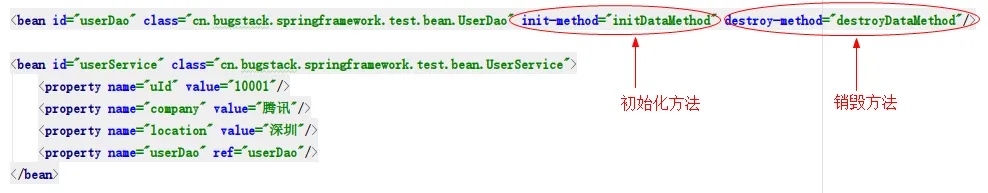
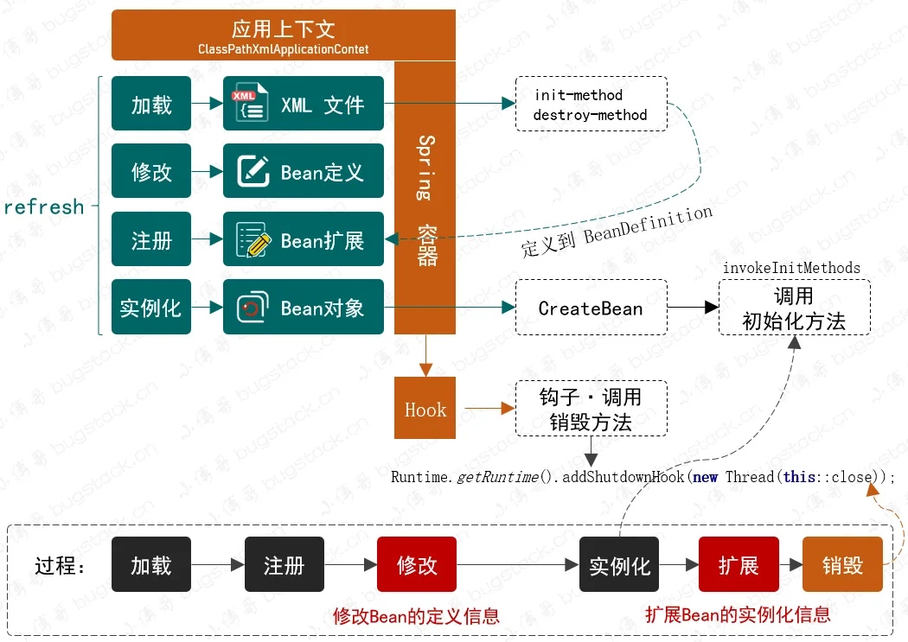

# 向虚拟机注册钩子，实现Bean对象的初始化和销毁方法

## 1. 目标

当我们的类创建的 Bean 对象，交给 Spring 容器管理以后，这个类对象就可以被赋予更多的使用能力。就像我们在上一章节已经给类对象添加了修改注册Bean定义未实例化前的属性信息修改和实例化过程中的前置和后置处理，这些额外能力的实现，都可以让我们对现有工程中的类对象做相应的扩展处理。

那么除此之外我们还希望可以在 Bean 初始化过程，执行一些操作。比如帮我们做一些数据的加载执行，链接注册中心暴漏RPC接口以及在Web程序关闭时执行链接断开，内存销毁等操作。**如果说没有Spring我们也可以通过构造函数、静态方法以及手动调用的方式实现，但这样的处理方式终究不如把诸如此类的操作都交给 Spring 容器来管理更加合适。** 因此你会看到到 spring.xml 中有如下操作：

需要满足用户可以在 xml 中配置初始化和销毁的方法，也可以通过实现类的方式处理，比如我们在使用 Spring 时用到的 `InitializingBean`, `DisposableBean` 两个接口。-其实还可以有一种是注解的方式处理初始化操作，不过目前还没有实现到注解的逻辑，后续再完善此类功能。

## 2. 设计

可能面对像 Spring 这样庞大的框架，对外暴露的接口定义使用或者xml配置，完成的一系列扩展性操作，都让 Spring 框架看上去很神秘。其实对于这样在 Bean 容器初始化过程中额外添加的处理操作，无非就是预先执行了一个定义好的接口方法或者是反射调用类中xml中配置的方法，最终你只要按照接口定义实现，就会有 Spring 容器在处理的过程中进行调用而已。整体设计结构如下图：

* 在 **spring.xml** 配置中添加 `init-method`、`destroy-method` 两个注解，在配置文件加载的过程中，把注解配置一并定义到 `BeanDefinition` 的属性当中。这样在 `initializeBean` 初始化操作的工程中，就可以通过**反射**的方式来调用配置在 Bean 定义属性当中的方法信息了。另外如果是**接口实现**的方式，那么直接可以通过 Bean 对象**调用对应接口定义的方法**即可，`((InitializingBean) bean).afterPropertiesSet()`，两种方式达到的效果是一样的。
* 除了在初始化做的操作外，`destroy-method` 和 `DisposableBean` 接口的定义，都会在 Bean 对象初始化完成阶段，执行注册销毁方法的信息到 `DefaultSingletonBeanRegistry` 类中的 `disposableBeans` 属性里，这是为了后续统一进行操作。这里还有一段适配器的使用，**因为反射调用和接口直接调用，是两种方式。所以需要使用适配器进行包装，下文代码讲解中参考 DisposableBeanAdapter 的具体实现**-关于销毁方法需要在虚拟机执行关闭之前进行操作，所以这里需要用到一个注册钩子的操作，如：`Runtime.getRuntime().addShutdownHook(new Thread(() -> System.out.println("close！")));` 这段代码你可以执行测试，另外你可以使用手动调用 `ApplicationContext.close` 方法关闭容器。

## 3. 实现

## 4. 测试

## 参考资料

[(https://mp.weixin.qq.com/s/eQIg3Fd2oUeRLdSrRSGVPw)](https://mp.weixin.qq.com/s/eQIg3Fd2oUeRLdSrRSGVPw)